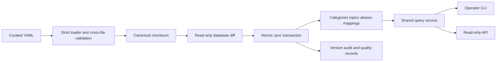

# Architecture overview

## Purpose

Signal Observatory is a durable observation system. The primary asset is persisted evidence that can be reprocessed after schemas, entity mappings, or metric definitions change. Serving a dashboard is downstream of preserving that evidence correctly.

## Data flow

```mermaid
flowchart LR
    Source["Public machine source"] --> Collector["Source collector"]
    Collector --> Bronze["Bronze: immutable raw record"]
    Bronze --> Normalize["Deterministic normalization"]
    Normalize --> Silver["Silver: normalized PostgreSQL entities"]
    Silver --> Aggregate["Versioned aggregation"]
    Aggregate --> Gold["Gold: reproducible metrics"]
    Gold --> Analytics["Analytics"]
    Analytics --> API["FastAPI"]
    API --> UI["React UI"]
```

E00-E02 implement the platform through Silver, add the curated Topic Registry, and define the Gold boundary. E02.5 adds a read-only Topic Observatory Experience. E03 adds selective arXiv Research observations. E04 adds explicit GitHub Repository discovery and forward-only Developer snapshots. Aggregations and trend algorithms remain deliberately absent.

## arXiv Research observation flow

```mermaid
flowchart LR
    Registry["Enabled Registry arXiv mapping"] --> Builder["Deterministic query builder"]
    Builder --> API["Official arXiv API"]
    API --> Raw["Immutable Raw response"]
    Raw --> Parser["Atom parser"]
    Parser --> Paper["Silver Paper authors categories"]
    Paper --> Match["Many-to-many Topic match"]
    Match --> Research["Read-only Research API"]
    Research --> Web["Topic Research surface"]
```

Every received response reaches Raw before parser or HTTP-status handling. `arxiv_raw_responses`
indexes the request evidence, and `arxiv_paper_observations` links each normalized observation to
the exact Raw checksum and ingestion run. `arxiv_topic_matches` records the explicit mapping and
query explanation; it does not assert an inferred semantic relationship.

## GitHub Developer observation flow

```mermaid
flowchart LR
    Registry["Enabled Registry GitHub mapping"] --> Discovery["Bounded Repository Search"]
    Discovery --> Match["Explainable Topic Repository match"]
    Match --> Identity["Numeric Repository identity"]
    Identity --> Poll["Daily ETag poll"]
    Poll --> Raw["Immutable Raw HTTP observation"]
    Raw --> Snapshot["Immutable daily Repository snapshot"]
    Snapshot --> Developer["Read-only Developer API"]
    Developer --> Web["Topic Developer surface"]
```

Discovery and snapshotting are independent schedules and use Search/Core budgets respectively.
`github_repositories` is the mutable current identity projection; daily snapshot rows are never
updated. A 304 Raw observation creates a `conditional_304` daily point from the previous known
state. No row is created for a day without a successful poll.

## Topic Registry control plane

`config/topics/` is the administrative source of truth. The package under
`packages/topic-registry/` owns schema, normalization, validation, checksums, diff, sync, and
queries. Source mappings remain source-specific YAML objects; the relational projection stores
their generic envelope and JSON configuration without teaching the core Topic model how a source
constructs requests.

## Runtime components

| Component     | Responsibility                                                    | Persistent writes        |
| ------------- | ----------------------------------------------------------------- | ------------------------ |
| API           | Health, Topic, Research, Developer, and source-status reads       | None                     |
| Worker        | Shared arXiv/GitHub UTC scheduler and graceful collector host     | Raw/Silver via collector |
| PostgreSQL    | Silver entities and ingestion lifecycle                           | Alembic-managed tables   |
| Web           | Read-only Registry, explorer, Research and Developer observations | None                     |
| LocalRawStore | Atomic Bronze publication and verification                        | `data/raw/`              |

Docker Compose orders startup as PostgreSQL healthy → API migrated/healthy → Worker and Web. The API validates its configuration, retries database startup connectivity, and disposes its engine during graceful shutdown. The worker exposes health through a readiness file that exists only while its database-validated event loop and validated UTC schedules are running. It polls wall time to tolerate host sleep and serializes source jobs with a shared lock. Manual collection, discovery, snapshots, status, and sampling remain available through the CLI.

The Web UI consumes only read-only Topic, Research, and Developer APIs. Featured topics are selected deterministically from active topics using editorial monitoring priority and top-level category diversity; observation counts do not affect that rule. Configured source mappings are displayed separately from observation state. Research becomes live only from a successful per-mapping cursor; Developer becomes live only from a successful GitHub snapshot; degraded history remains visible. Hacker News and Wikipedia stay not collecting.

## Bronze invariants

- Payload bytes are gzip-compressed but semantically unchanged.
- Every record has SHA-256, byte length, source, request timestamp, collector version, schema version, and source metadata.
- Paths are deterministic and partitioned by source and UTC request date.
- A complete record is published by one same-filesystem directory rename.
- Existing records are verified and returned, never overwritten.
- Reads verify both checksum and uncompressed length.

The filesystem implementation is intentionally local. A future object-store implementation must preserve the same `RawStore` invariants, but no cloud abstraction is introduced before it is needed.

## Silver invariants

- The database schema is created and changed only through Alembic.
- UUID primary keys are generated by the application.
- Date/time values reject naive timestamps and normalize to UTC.
- Topic names and aliases have normalized unique keys.
- Curated topics are versioned projections of validated YAML.
- Missing YAML entities are retained and surfaced; retirement uses explicit deprecation.
- Every changed registry sync is atomic and produces audit and quality records.
- Reapplying an unchanged registry is a no-op.
- Ingestion counters are non-negative.
- Every ingestion transitions from `running` to exactly one terminal state and records its checkpoint boundary.
- Canonical arXiv Paper identity excludes the version suffix; new versions update current Silver
  while retaining immutable Raw observations.
- Paper/Topic is many-to-many and every match records its Registry mapping and exact query.
- Author order and arXiv categories are relational; author display names are not resolved identities.
- Per-mapping cursors advance only after durable Raw and Silver persistence.
- GitHub Repository external identity is numeric; `full_name` is mutable display metadata.
- Repository/Topic is many-to-many and every match records mapping, query, rank, run, and Raw.
- Repository snapshots are immutable, unique per Repository/UTC date, and begin at first observation.
- ETag poll state advances only after Raw and daily snapshot semantics commit.

## Gold boundary

Gold values must identify the topic, metric name, UTC window, numeric value, and metric definition version. Implementations must derive values from persisted Bronze/Silver inputs. E03 Research counts and E04 Repository totals/deltas are read-time observation summaries, not Gold metrics. No Trend Score is defined because a score without a versioned definition would not be reproducible.

## Reliability and security

- Database connection is checked with bounded retries before a process advertises readiness.
- Unexpected request errors are logged structurally and return a generic response.
- Processes remove readiness state and dispose database connections on shutdown.
- Raw source identifiers are allowlisted to prevent path traversal.
- Secrets come from environment variables or a secret store and are never included in startup summaries.
- Collector implementations must respect official authentication, rate limits, robots/anti-bot controls, and source terms.
