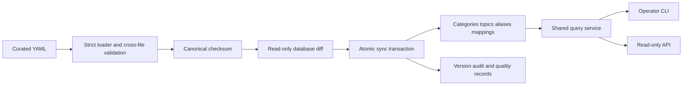

# Architecture overview

## Purpose

Signal Observatory is a durable observation system. The primary asset is persisted evidence that can be reprocessed after schemas, entity mappings, or metric definitions change. Serving a dashboard is downstream of preserving that evidence correctly.

## Data flow

```mermaid
flowchart LR
    Source["Public machine source"] --> Collector["Source collector"]
    Collector --> Bronze["Bronze: immutable raw record"]
    Bronze --> Normalize["Deterministic normalization"]
    Normalize --> Silver["Silver: normalized PostgreSQL entities"]
    Silver --> Aggregate["Versioned aggregation"]
    Aggregate --> Gold["Gold: reproducible metrics"]
    Gold --> Analytics["Analytics"]
    Analytics --> API["FastAPI"]
    API --> UI["React UI"]
```

E00-E02 implement the platform through Silver, add the curated Topic Registry, and define the Gold boundary. E02.5 adds a read-only Topic Observatory Experience over the existing API. Real source collection, aggregations, and trend algorithms remain deliberately absent.

## Topic Registry control plane

`config/topics/` is the administrative source of truth. The package under
`packages/topic-registry/` owns schema, normalization, validation, checksums, diff, sync, and
queries. Source mappings remain source-specific YAML objects; the relational projection stores
their generic envelope and JSON configuration without teaching the core Topic model how a source
constructs requests.

## Runtime components

| Component     | Responsibility                                     | Persistent writes           |
| ------------- | -------------------------------------------------- | --------------------------- |
| API           | Health/readiness and read-only Topic query surface | None                        |
| Worker        | Graceful long-running collector host               | None until collectors exist |
| PostgreSQL    | Silver entities and ingestion lifecycle            | Alembic-managed tables      |
| Web           | Read-only Registry overview, explorer, and detail  | None                        |
| LocalRawStore | Atomic Bronze publication and verification         | `data/raw/`                 |

Docker Compose orders startup as PostgreSQL healthy → API migrated/healthy → Worker and Web. The API validates its configuration, retries database startup connectivity, and disposes its engine during graceful shutdown. The worker exposes health through a readiness file that exists only while its database-validated event loop is running.

The Web UI consumes only the read-only Topic API. Featured topics are selected deterministically from active topics using editorial monitoring priority and top-level category diversity; the selection is a presentation rule, not persisted business state. Configured source mappings are displayed separately from future observation slots so the UI cannot imply that a collector is live before persisted observations exist.

## Bronze invariants

- Payload bytes are gzip-compressed but semantically unchanged.
- Every record has SHA-256, byte length, source, request timestamp, collector version, schema version, and source metadata.
- Paths are deterministic and partitioned by source and UTC request date.
- A complete record is published by one same-filesystem directory rename.
- Existing records are verified and returned, never overwritten.
- Reads verify both checksum and uncompressed length.

The filesystem implementation is intentionally local. A future object-store implementation must preserve the same `RawStore` invariants, but no cloud abstraction is introduced before it is needed.

## Silver invariants

- The database schema is created and changed only through Alembic.
- UUID primary keys are generated by the application.
- Date/time values reject naive timestamps and normalize to UTC.
- Topic names and aliases have normalized unique keys.
- Curated topics are versioned projections of validated YAML.
- Missing YAML entities are retained and surfaced; retirement uses explicit deprecation.
- Every changed registry sync is atomic and produces audit and quality records.
- Reapplying an unchanged registry is a no-op.
- Ingestion counters are non-negative.
- Every ingestion transitions from `running` to exactly one terminal state and records its checkpoint boundary.

## Gold boundary

Gold values must identify the topic, metric name, UTC window, numeric value, and metric definition version. Implementations must derive values from persisted Bronze/Silver inputs. No Trend Score is defined in E01 because a score without stable sources and a versioned definition would not be reproducible.

## Reliability and security

- Database connection is checked with bounded retries before a process advertises readiness.
- Unexpected request errors are logged structurally and return a generic response.
- Processes remove readiness state and dispose database connections on shutdown.
- Raw source identifiers are allowlisted to prevent path traversal.
- Secrets come from environment variables or a secret store and are never included in startup summaries.
- Collector implementations must respect official authentication, rate limits, robots/anti-bot controls, and source terms.
